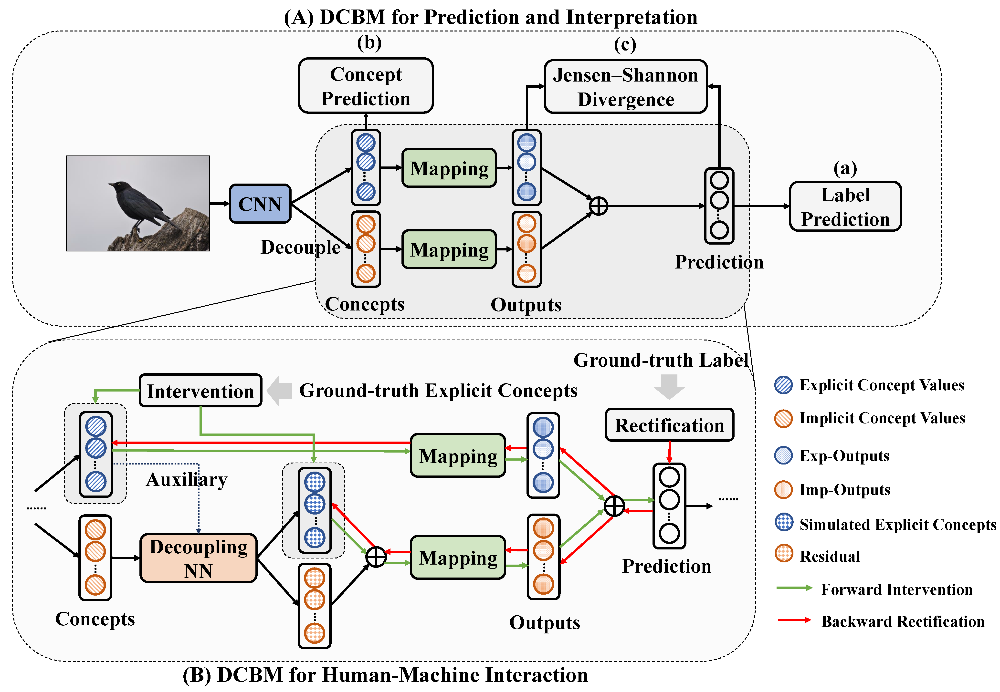

# DCBM README

This is an implementation of the IEEE TPAMI paper [The Decoupling Concept Bottleneck Model](https://ieeexplore.ieee.org/document/10740789) (DCBM). The vision-language-model (VLM) part is being refined and will be available soon.  



*Figure 1*: **DCBM Pipeline**. (A) DCBM for prediction and interpretation. (B) DCBM for human-machine interaction, including forward intervention and backward rectification. 

## Citation
If you find our paper/code useful in your research, welcome to cite our work
```
@article{zhang2024decoupling,
  author={Zhang, Rui and Du, Xingbo and Yan, Junchi and Zhang, Shihua},
  journal={IEEE Transactions on Pattern Analysis and Machine Intelligence}, 
  title={The Decoupling Concept Bottleneck Model}, 
  year={2024},
  pages={1-16},
  doi={10.1109/TPAMI.2024.3489597}}
```

## To-do list
- [x] concept/label learning
- [ ] the introduction of data preprocessing
- [x] forward intervention and backward rectification
- [ ] VLM-based DCBM

## Prerequisites
- Please run `pip install -r requirements.txt` to achieve the environment.
- This repo is executed under `torch=2.4.0+cu118` and `pytorch-lightning=2.3.3`. Please find the suitable versions of [torch](https://pytorch.org/) and [pytorch-lightning](https://lightning.ai/docs/pytorch/stable/versioning.html#compatibility-matrix).

## Datasets
We use CUB, Derm7pt, and CelebA in this repository. Please refer to:
#### CUB
[Original Dataset](http://www.vision.caltech.edu/datasets/cub_200_2011/), [Processed Dataset](https://worksheets.codalab.org/worksheets/0x362911581fcd4e048ddfd84f47203fd2).
#### Derm7pt
[Original Dataset](http://derm.cs.sfu.ca).
#### CelebA
[Original Dataset](https://mmlab.ie.cuhk.edu.hk/projects/CelebA.html).

## Usage
We provide several tools in this repository. Take `CUB` as an example, we have:

### Concept and Label Prediction
#### Train
```
python main.py -d CUB -seed 0
```

#### Inference
```
python main.py -d CUB_test -seed 0
```

### Forward Intervention and Backward Rectification
#### Train the Decoupling Network and MI Network, and Simultaneously Inference for Forward Intervention
```
python main_int.py -d CUB_df -seed 0
```

#### Inference for Backward Rectification
```
python main_rec.py -d CUB_int -seed 0
```

### To be continued...

## Directory

```
|-- README.md
|-- main.py
|-- main_int.py
|-- main_rec.py
|-- requirements.txt
|-- configs
    |-- CUB.yaml
    |-- CUB_test.yaml
    |-- CUB_df.yaml
    |-- CUB_int.yaml
    |-- Derm7pt.yaml
    |-- Derm7pt_test.yaml
    |-- Derm7pt_df.yaml
    |-- Derm7pt_int.yaml
    |-- celeba.yaml
    |-- celeba_test.yaml
    |-- celeba_df.yaml
    |-- celeba_int.yaml
|-- data
    |-- __init__.py
    |-- CUB.py
    |-- Derm7pt.py
    |-- celeba.py
    |-- data_interface.py
    |-- data_utils.py
    |-- mine.py
|-- images
    |-- DCBM_pipeline.png
|-- models
    |-- __init__.py
    |-- dcbm.py
    |-- model_interface.py
    |-- template_model.py
    |-- mine.py
|-- saves
    |-- celeba_imbalance.pth
|-- utils
    |-- __init__.py
    |-- analysis.py
    |-- base_utils.py
    |-- config.py
    |-- intervention.py
```